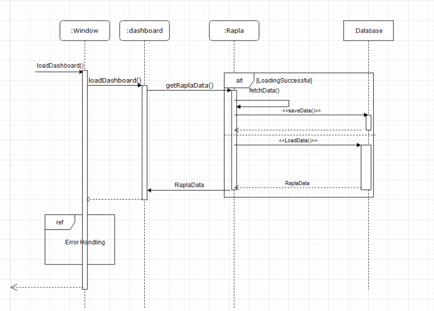
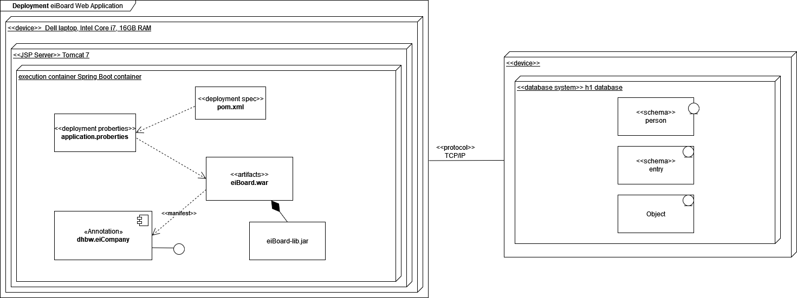
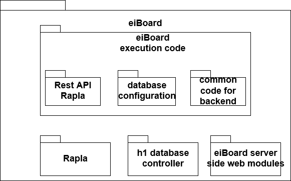
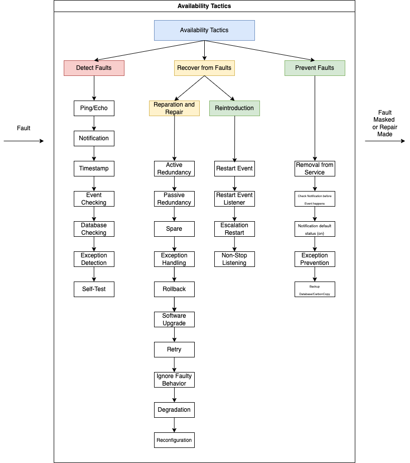

# eiBoard - Software Architecture Documentation

## Table of contents
- [Table of contents](#table-of-contents)
- [Introduction](#1-introduction)
    - [Purpose](#11-purpose)
    - [Scope](#12-scope)
    - [Definitions, Acronyms and Abbreviations](#13-definitions-acronyms-and-abbreviations)
    - [References](#14-references)
    - [Overview](#15-overview)
- [Architectural Representation](#2-architectural-representation)
- [Architectural Goals and Constraints](#3-architectural-goals-and-constraints)
- [Use-Case View](#4-use-case-view)
    - [Use-Case Realization](#41-use-case-realization)
- [Logical View](#5-logical-view)
    - [Overview](#51-overview)
    - [Architecturally Significant Design Packages](#52-architecturally-significant-design-packages)
- [Process View](#6-process-view)
- [Deployment View](#7-deployment-view)
- [Implementation View](#8-implementation-view)
    - [Overview](#81-overview)
    - [Implementation View](#82-layers)
- [Data View](#9-data-view)
- [Size and Performance](#10-size-and-performance)
- [Quality](#11-quality)

 

## 1. Introduction
### 1.1 Purpose
This Software Architecture Document (SAD) provides an overview of the entire Software Architecture Document. It provides a comprehensive architectural overview of the system, using a number of different architectural views to depict different aspects of the system. It is intended to capture and convey the significant architectural decisions which have been made on the system.

### 1.2 Scope
[A brief description of what the Software Architecture Document applies to; what is affected or influenced by this document.]

### 1.3 Definitions, Acronyms and Abbreviations
| Abbrevation | Explanation                            |
| ----------- | -------------------------------------- |
| API         | Application Programming Interface      |
| FAQ         | Frequently asked Questions             |
| n/a         | not applicable                         |
| SRS         | Software Requirements Specification    |
| UC          | Use Case                               |
| UCD         | Overall Use Case Diagram               |
| RaPla       | Raum Planer                            |

### 1.4 References

| Title                                                              | Date       | Publishing organization   |
| -------------------------------------------------------------------|:----------:| ------------------------- |
| [eiCompany Blog](https://eicompany.wordpress.com/)                 | 20.10.2022 | eiCompany                 |

### 1.5 Overview
[This subsection describes what the rest of the Software Architecture Document contains and explains how the Software Architecture Document is organized.]
    
## 2. Architectural Representation
Logical View:

The Logical View is based on our End-user functionalities. Since eiBoard is a dashboard for planning daily tasks, but also university tasks, the objects "daily todo", "uni-todo" and "user" are created there. This displays university tasks directly to the user. In addition, he can add his own tasks and see his timetable.

Process View:

For the process view, there are different views in which to view eiBoard. First of all, we looked at the login. The LoginSequenceDiagram(URL: https://github.com/eiBoard-Company/eiBoard/blob/documentation/LoginSequenceDiagram.png) basically shows that the user sees the login page and enters his login data there. This data is sent to the backend, which then compares it with the help of a database and sends back a result.

Development View:

There are currently 4 subsystems for the development view. The subsystem "Account" is responsible for the modules "Login" and "Registration". If the login is successful, the subsystem "Dashboard" is used. This contains the modules "Calendar", "Tasklist", "Navigation" and "Impressumbar". If the "Calendar" module is accessed, the "Rapla" subsystem is called, which returns the requested timetable entries. On the other hand, when the "Tasklist" module is accessed, the "Database" subsystem is called, which returns the data within the "Person" module and its corresponding "Entry" and "Type" modules.
(Component-Diagram: https://github.com/eiBoard-Company/eiBoard/blob/documentation/UML_component_diagram.png)

Physical View:

The eiBoard software can be used both in the browser and on mobile Android devices. This was realised through the Flutter development kit. The frontend communicates with the backend, which was realised with Spring Boot. This has the advantage that database entities can be created directly in the Java code and simple routing takes place. The entire backend runs on a Jakarta server and can also access the Rapla content via a Rest API.

## 3. Architectural Goals and Constraints
**MVC**
Frontend and backend are using the MVC pattern. This enables a clean software architecture with separate model view and controller.

**Front end**
The App Client is realized with Flutter. In the Frontend no MVC Tool is needed, because the MVC Pattern is integrated into Flutter development.
View: activities in the app

**Back end**
The back end is written in Java. As MVC tool we are using Spring Boot. As a database we are using H2. The Server offers multiple REST APIs which are accessed by our front end.
Model: domain specific classes
Controller: RestController

Most important are the three subsystems in the application:
- Start dashboard: The essential part of the UI, which shows the DHBW rapla schedule, tasks, and exams.
- Account system: Users of eiBoard can create their own accounts to get their personal space. The account will also be connected with the rapla calendar to show each user’s schedule.
- Database system: All the data which is shown by the start dashboard of each user should be stored in a database. For the database we decided to use H2 database which is an in-memory database but can also used on a persistent level.
For the design of eiBoard there is a style guide, which includes all fonts and style.
The whole application progress is stored on GitHub and documented by a WordPress blog.

## 4. Use-Case View
[This section lists use cases or scenarios from the use-case model if they represent some significant, central functionality of the final system, or if they have a large architectural coverage—they exercise many architectural elements or if they stress or illustrate a specific, delicate point of the architecture.]

### 4.1 Use-Case Realizations
[This section illustrates how the software actually works by giving a few selected use-case (or scenario) realizations, and explains how the various design model elements contribute to their functionality.]
 
## 5. Logical View
[This section describes the architecturally significant parts of the design model, such as its decomposition into subsystems and packages. And for each significant package, its decomposition into classes and class utilities. You should introduce architecturally significant classes and describe their responsibilities, as well as a few very important relationships, operations, and attributes.]

### 5.1 Overview
[This subsection describes the overall decomposition of the design model in terms of its package hierarchy and layers.]

### 5.2 Architecturally Significant Design Packages
[For each significant package, include a subsection with its name, its brief description, and a diagram with all significant classes and packages contained within the package.
For each significant class in the package, include its name, brief description, and, optionally, a description of some of its major responsibilities, operations, and attributes.]

## 6. Process View
Questions to answer when drawing component diagram

- What are the major executing components and how do they interact at runtime?
- What are the major shared data stores?
- Which parts of the system are replicated?
- How does data progress through the system?
- Which parts of the system can run in parallel?

## 7. Deployment View

## 8. Implementation View

### 8.1 Overview
eiBoard execution code: In this package is stored everything which can be executed as code. For example the whole Backend and Frontend for eiBoard. Furhtermore the database configuaration and the code for the Rapla API are stored in it.

Rapla: defines the Rapla interface that gives common schedule informations back to the eiBoard system.

h1 database controller: is a web-based interface that shows the database controller and all entites with their entries.

Click [here](https://github.com/eiBoard-Company/eiBoard/blob/documentation/Implementation_View.png) for the Diagram.

### 8.2 Layers
Subsystem:
- Dashboard: Calendar, Tasklist, Navigation, Impressumbar
- Account: Login, Sign Up
- Rapla: Lecture, ScheduleDay, RaplaApi
- Database: Entry, Person, Type

Click [here](https://github.com/eiBoard-Company/eiBoard/blob/documentation/UML_component_diagram.png) for the Component Diagram.

## 9. Data View
[A description of the persistent data storage perspective of the system. This section is optional if there is little or no persistent data, or the translation between the Design Model and the Data Model is trivial.]

## 10. Size and Performance

 Reliability: Make the software architecture reliable so that any mistakes won't completely shut it down
 
 Security: The software architecture should protect the data of the users so that their personal data isnt visible to anyone that not supposed to see it
 
 Accesability: Make the Software avaible on as much ways as possible so users have their data everywhere they need it at the same time, e.g. mobile phone, tablet, Laptop...
 

## 11. Quality
Interoperability: Connect with rapla Api to show data as entry in the calendar. Create carbon copy in parallel thread. Frequently update the carbon copy (table in database for the rapla entries, if connection crushes don’t worry, database does not need to be restarted only update of rapla table), frequently ping to make sure that rapla is connectable. Write logs to make bugfixing easier.

Availability: Set notification as default. Save timestamps for notification in cache to avoid a “sleepy entry”. Check the availability before making alarm. If Error occurs send alarm message to user and developer. (Alarm will be there in any case, entry wont be overslept). Write logs to make bugfixing easier.

Click [here](https://github.com/eiBoard-Company/eiBoard/blob/documentation/Interoperability%20Checklist.docx) for the additional Interoperability Tactics Checklist.

