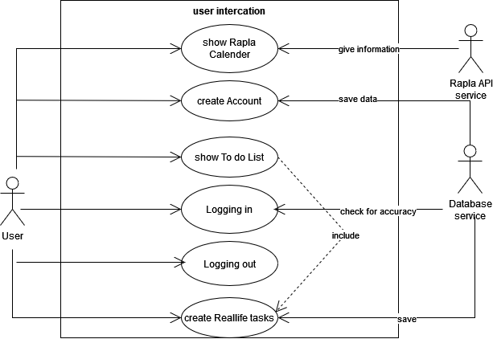

# eiBoard - Software Requirements Specification 

## Table of contents
- [Table of contents](#table-of-contents)
- [Introduction](#1-introduction)
    - [Purpose](#11-purpose)
    - [Scope](#12-scope)
    - [Definitions, Acronyms and Abbreviations](#13-definitions-acronyms-and-abbreviations)
    - [References](#14-references)
    - [Overview](#15-overview)
- [Overall Description](#2-overall-description)
    - [Vision](#21-vision)
    - [Use Case Diagram](#22-use-case-diagram)
	- [Technology Stack](#23-technology-stack)
- [Specific Requirements](#3-specific-requirements)
    - [Functionality](#31-functionality)
    - [Usability](#32-usability)
    - [Reliability](#33-reliability)
    - [Performance](#34-performance)
    - [Supportability](#35-supportability)
    - [Design Constraints](#36-design-constraints)
    - [Online User Documentation and Help System Requirements](#37-online-user-documentation-and-help-system-requirements)
    - [Purchased Components](#38-purchased-components)
    - [Interfaces](#39-interfaces)
    - [Licensing Requirements](#310-licensing-requirements)
    - [Legal, Copyright And Other Notices](#311-legal-copyright-and-other-notices)
    - [Applicable Standards](#312-applicable-standards)
- [Supporting Information](#4-supporting-information)

## 1. Introduction
### 1.1 Purpose
This Software Requirements Specification (SRS) describes all specifications for the application "eiBoard". It includes an overview about this project and its vision, detailed information about the planned features and boundary conditions of the development process.

### 1.2 Scope
The project is going to be realized with Flutter Framework as a mobile App.
Actors of this App can be users or moderators.

Planned Subsystems are:
- Start Dashboard:
	The dashboard is the essential part of the user interface. When a user opens the app he will be up to date with all that's going on in their schedule, tasks, and exams. The data must be stored accordingly.
- Account System:
	Users can create an account for their personal calendar. It should be possible to get the timetable from rapla to make the app more user friendly. User data must be stored alongside the posting data.
- Storing Data:
	User data for accounts and possibly profiles has to be stored. The data storage will form the foundation for the visualization, account system and the search feature.

### 1.3 Definitions, Acronyms and Abbreviations
| Abbrevation | Explanation                            |
| ----------- | -------------------------------------- |
| API         | Application Programming Interface      |
| FAQ         | Frequently asked Questions             |
| n/a         | not applicable                         |
| SRS         | Software Requirements Specification    |
| UC          | Use Case                               |
| UCD         | Overall Use Case Diagram               |
| RaPla       | Raum Planer                            |

### 1.4 References

| Title                                                              | Date       | Publishing organization   |
| -------------------------------------------------------------------|:----------:| ------------------------- |
| [eiCompany Blog](https://eicompany.wordpress.com/)                 | 20.10.2022 | eiCompany                 |
| [RaPla](https://rapla.dhbw-karlsruhe.de/rapla?page=calendar&user=eisenbiegler&file=TINF21B4) | 20.10.2022 | DHBW Karlsruhe RaPla                     |
| [Material Design Guidelines](https://m3.material.io/) | 20.10.2022 | Google |

### 1.5 Overview
The following chapter provides an overview of this project with vision and Overall Use Case Diagram. The third chapter (Requirements Specification) delivers more details about the specific requirements in terms of functionality, usability and design parameters. Finally there is a chapter with supporting information. 
    
## 2. Overall Description

### 2.1 Vision
The eiBoard Company is an interactive online planner dashboard. It is supposed to implement the lecture schedule from Rapla. Users will be able to keep track of their appointments, assignments, homework, final exam dates and more. Users will be notified when an appointment is coming up.

### 2.2 Use Case Diagram

### 2.3 Technology Stack
We are using following technology:

Backend: Java and Spring

Frontend: Flutter

IDE: VS Code, IntelliJ IDEA and Eclipse

Project Management: YouTrack and GitHub

Testing: JUnit and Selenium

Design: Adobe InDesign and Illustrator

## 3. Specific Requirements

### 3.1 Functionality
This section will explain the different use cases, you could see in the Use Case Diagram, and their functionality.
- 3.1.1 Rapla calendar/Schedule
- 3.1.2 Task/To do list
- 3.1.3 Viewing Classes and creating Events
- 3.1.4 Creating an account
- 3.1.5 Logging in
- 3.1.6 Logging out
- 3.1.7 View Classes
- 3.1.8 Settings
- 3.1.9 Managing database

#### 3.1.1 Rapla calendar/Schedule
To keep track of all lectures users want to see their schedules in the app. This will be realized with the help of an Rapla API. The user can do a request with a timeperiod or just one single date via GET Request to the Rapla API. With the help of the date, Rapla will send all data of lectures of this timestamp back to the user.

[Rapla calendar/Schedule](UC1_SCHEDULE.md)

#### 3.1.2 Task/To do List
To keep track of all things to do users want to see their to dos as well as adding to dos. In the frontend there will be the opportunity to add new tasks. The new added task will be saved by a database in the backend. After witing new tasks, the frontend will show these. There is also the opportunity to edit them-

[Tasks/To do List](UC2_TASKS.md)

#### 3.1.3 Creating events
To keep their schedule accurate users want to create new events.

[Creating events](UC3_EVENTS.md)

#### 3.1.4 Creating an account
To identify all users we need an account system. This account system enables us to build important functions such as a personalized overview over all tasks and appointments. The user information will be stored into a third party system named "Keycloak".

[Creating an account](UC4_CREATE_ACCOUNT.md)

#### 3.1.5 Logging in
The app will provide the possibility to register and log in. This will also make the usability easier as a user won’t have to add all his appointments again. The register and logging in process will be managed by Keylcoak. Keycloak uses the OAuth 2.0 standard to identify and authorize users which logged in or signed in.

[Logging in](UC5_LOGIN.md)

#### 3.1.6 Logging out
In case you share your phone, have multiple accounts or just want to be cautious about your privacy you should be able to manually log out.

[Logging out](UC6_LOGGING_OUT.md)

#### 3.1.7 View Classes
To have a good overview users want to view their classes.

[View classes](UC7_CLASSES.md)

#### 3.1.8 Settings
To have a good user experience the user needs settings. The settings are summarized by a name and password change system and an "About Us" page.

[View settings](UC8_SETTINGS.md)

#### 3.1.9 Managing database
Hibernate is going to be the framework for our SQL database system.

### 3.2 Usability
We plan on designing the user interface as intuitive and self-explanatory as possible to make the user feel as comfortable as possible using the app. We will also add an FAQ page, just in case the user would have any questions.

#### 3.2.1 No training time needed
Our goal is that a user installs the application, opens it and is able to use all features without any explanation or help.

#### 3.2.2 Familiar Feeling
We want to implement an app with familiar designs and functions. This way the user is able to interact in familiar ways with the app without having to get to know new interfaces. Here we will be taking a look at the [Material Design Guidelines](https://m3.material.io/).

### 3.3 Reliability

#### 3.3.1 Availability
Our server will be available all around the clock. 

#### 3.3.2 Defect Rate
Our goal is to have no loss of any data. This is important so that users can rely on the app for all upcoming tasks and appointments.

### 3.4 Performance

#### 3.4.1 Capacity
The system should be able to manage thousands of requests. It should also be possible to register as many users as necessary.

#### 3.4.2 Storage 
Smartphone users don't want their apps to take up too much storage. Therefore we are aiming to keep the needed storage as small as possible.

#### 3.4.3 App perfomance / Response time
To provide the best App perfomance we aim to keep the response time as low as possible. This will make the user experience much better.

### 3.5 Supportability

#### 3.5.1 Coding Standards
We are going to write the code by using all of the most common clean code standards. For example we will name our variables and methods by their functionalities. This will keep the code easy to read by everyone and make further developement much easier. When merging onto the main branch we will have one ore more read over that code to assure the quality. Furthermore we'll try to organize our Code according to the View-Model-Controller Model.

#### 3.5.2 Testing Strategy
The application will have a high test coverage and all important functionalities and edge cases should be tested. Further mistakes in the implementation will be discovered instantly and it will be easy to locate the error. 

### 3.6 Design Constraints
We are trying to provide a modern and easy to handle design for the UI and the architecture of our application. To achieve that the functionalities will be kept as modular as possible.

Because we are progamming a mobile app for the main operating systems we chose Flutter for the Frontend. As we already have some experience with Java and Spring we will use it for the Backend. 
The supported Platforms will be:
- Android 4.1 and higher
- iOS 11 and higher
- Java 8 and higher
- other platforms can be found [here](https://docs.flutter.dev/development/tools/sdk/release-notes/supported-platforms#supported-platforms).

### 3.7 Online User Documentation and Help System Requirements
The usage of the app should be as intuitive as possible so it won't need any further documentation. If the user needs some help they will find the FAQ page or will be able to contact us through the App or via E-Mail.

### 3.8 Purchased Components
We don't have any purchased components yet. If there will be purchased components in the future we will list them here.

### 3.9 Interfaces

#### 3.9.1 User Interfaces
The User interfaces that will be implemented are:
- Login Page - this page is used to log in
- Sign up Page - provides a simple registration form
- Dashboard/Start Page - lists todays schedule, current tasks, upcoming exams and overview of how many tasks are finished
- Task page - overview of all tasks - they can also click on tasks to see more details
- Schedule page - displays the schedule, either a daily or weekly view, users can choose
- Classes page - users can find their classes here and click on them for more information
- Exams page - displays all exams for the current semester
- Useful link page - all kinds of useful links for the DHBW
- Menu - users can navigate to all pages from there
- Settings - shows the settings where users can navigate to: Profile , Design, Push messages, FAQ and About Us
- Profile page - users can change their profile picture, name, E-Mail, password and the Rapla link from where their schedule will be imported
- Design page - users can choose whether they want the app design to be in light or dark mode and choose the primary color for a tailored user experience
- Push messages page - users can choose whether they want to receive push messages from eiBoard and if so what kind of messages
- FAQ and About Us page - users can come here for help and to find out more about eiBoard

#### 3.9.2 Hardware Interfaces
(n/a)

#### 3.9.3 Software Interfaces
The app will be runnable on Android 4.1 and higher, and iOS 11 and higher.

#### 3.9.4 Communication Interfaces
The server and hardware will communicate using the http protocol. 

### 3.10 Licensing Requirements

### 3.11 Legal, Copyright, and Other Notices
The logo is licensed to the eiCompany and is only allowed to use for the eiBoard application. We do not take responsibilty for any incorrect data or errors in the application.

### 3.12 Applicable Standards
The development will follow the common clean code standards and naming conventions. Also we will create a Style Sheet of which will be added here as soon as its complete.

## 4. Supporting Information
For any further information you can contact the eiBoard team or check out our [eiCompany Blog](https://eicompany.wordpress.com/). 
The Team Members are:
- Eileen Fahrner
- Niklas Geppert
- Marius Schad
- Matteo Staar
- Julian Stadler
