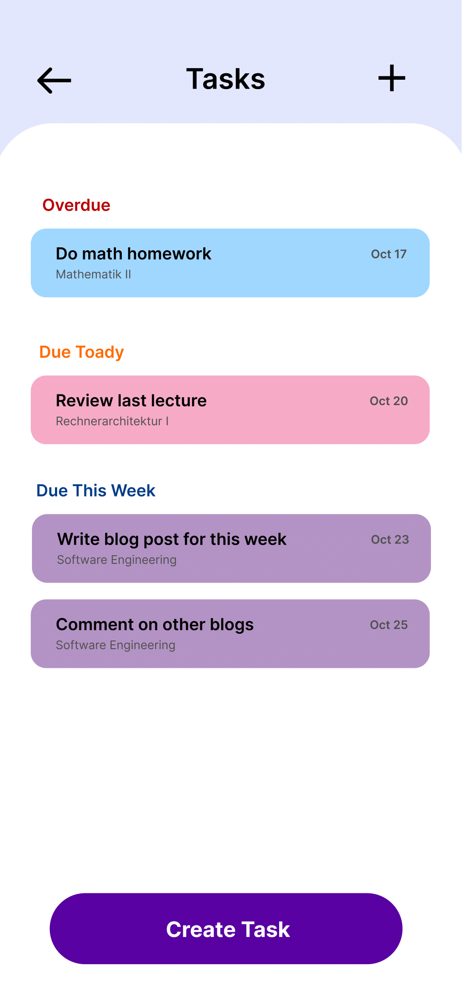
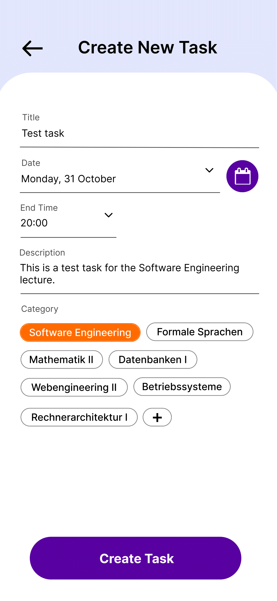
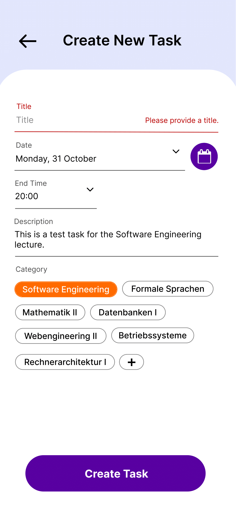

# Use-Case Specification: Task/To do List

# 1. Task/To do List

## 1.1 Brief Description
This use case allows users to create and see created tasks.

## 1.2 Mockup
 &nbsp;  &nbsp;  &nbsp; 

- Errors

# 2. Flow of Events

## 2.1 Basic Flow
- user clicks on Menu - Tasks
- data will be sent from database
- Task page opens
- if user already created tasks, tasks will be displayed
- user can click on a task for more detail
- with a click on the '+' users can create new tasks

# 3. Special Requirements

# 4. Preconditions
The Preconditions for this use case are:
1. The user has the app installed
2. User needs an account to create and see created tasks
3. To see tasks user had to create tasks beforehand

# 5. Postconditions
Task is created and displayed

# 6. Function Points
Total number of story points: 13
