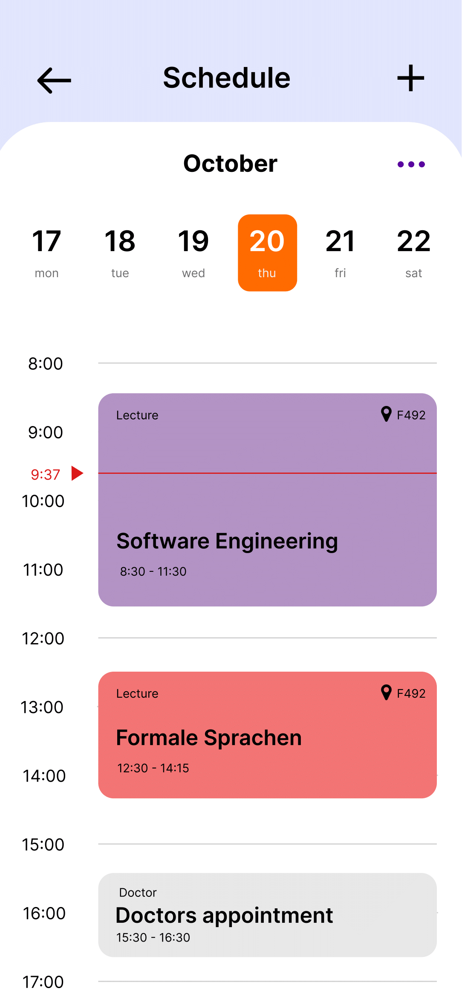
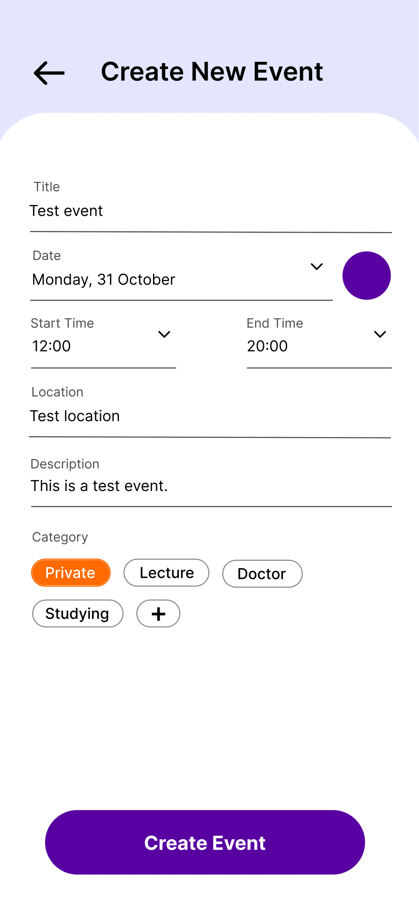
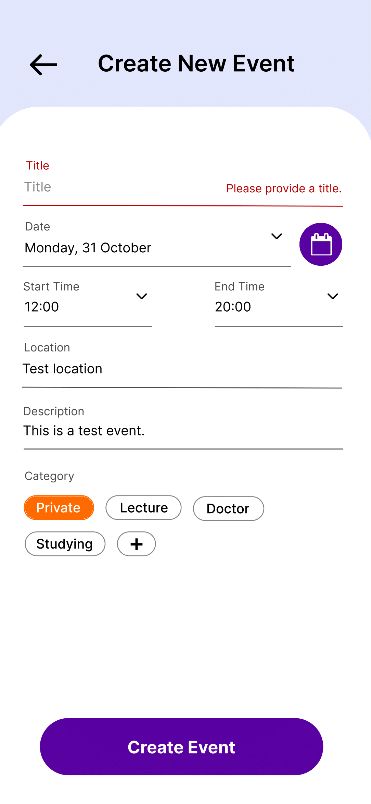

# Use-Case Specification: Creating Events

# 1. Creating Events

## 1.1 Brief Description
This use case allows users to create events that they will be able to see in their schedule.

## 1.2 Mockup
 \t  \t 

- Errors

# 2. Flow of Events

## 2.1 Basic Flow
- user clicks on Menu - Schedule
- data will be sent from database
- Schedule page opens
- if user already created events or linked a Rapla URL, schedule will be displayed
- with a click on the '+' users can create new events

# 3. Special Requirements

# 4. Preconditions
The Preconditions for this use case are:
1. The user has the app installed
2. User needs an account to create events

# 5. Postconditions
Event is created and displayed

# 6. Function Points
Total number of story points: 8
