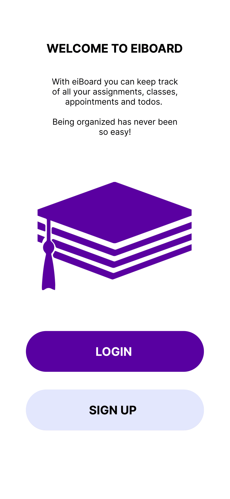
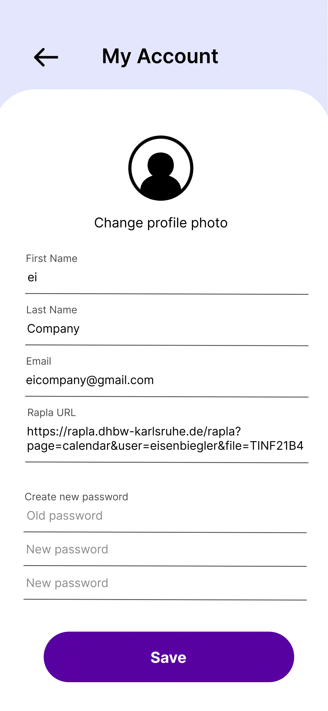
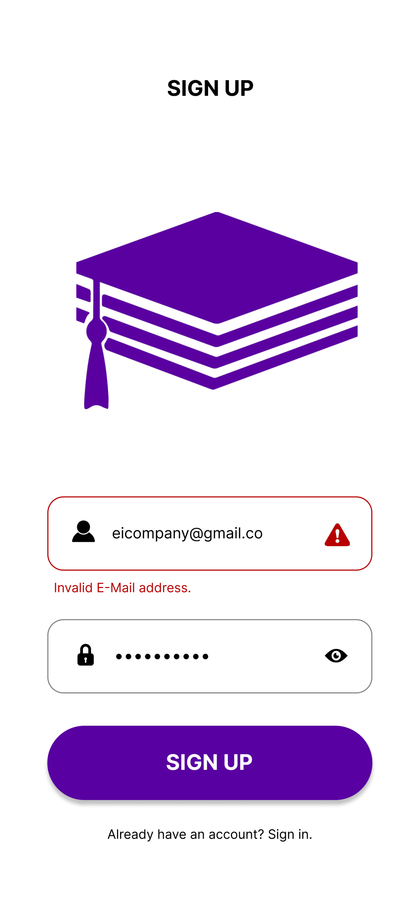
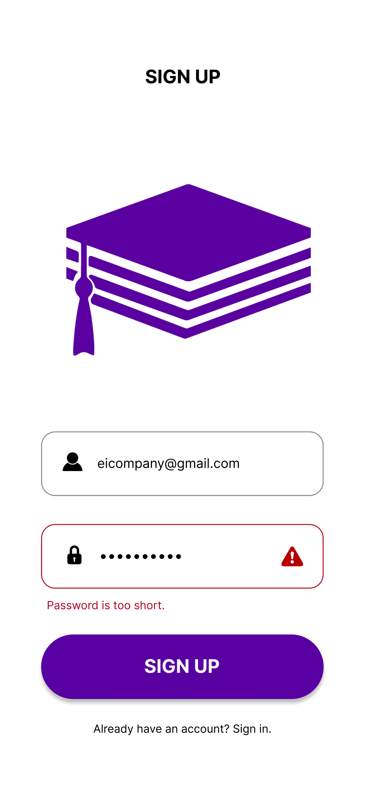
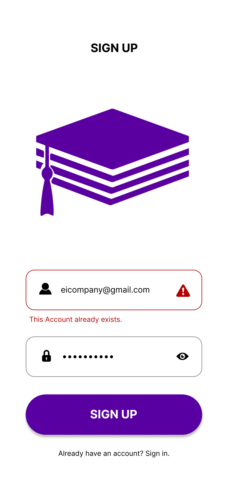

# Use-Case Specification: Create Account

# 1. Create Account

## 1.1 Brief Description
This use case allows anyone to register and create an account. The data will be secure saved in our data base.

## 1.2 Mockup

- Errors

# 2. Flow of Events

## 2.1 Basic Flow
- user clicks on Sign Up
- Sign Up page opens
- user fills in their data
- user clicks on Sign Up button
- data will be validated and sent to the database

# 3. Special Requirements
User needs an email account to register

# 4. Preconditions
The Preconditions for this use case are:
1. The user has the app installed
2. The user clicks on Sign Up

# 5. Postconditions
The app opens the profile page so user can complete his profile

# 6. Function Points
Total number of story points: 8
