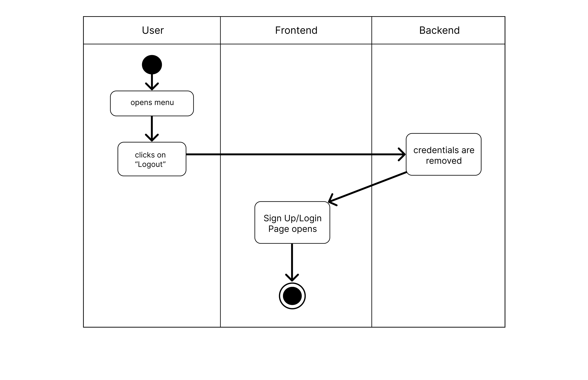

# Use-Case Specification: Logging Out

# 1. Logging Out

## 1.1 Brief Description
This use case allows a logged in user to log out.

## 1.2 Mockup

# 2. Flow of Events

## 2.1 Basic Flow
- User is logged in
- User opens menu and clicks "Logout"
- App returns to login screen

## Activity Diagram

# 3. Special Requirements
- The user already has set up an account

# 4. Preconditions
The Precondition for this use case is:
1. The user is logged in

# 5. Postconditions
User credentials are removed

# 6. Story Points
Total number of story points: 3
