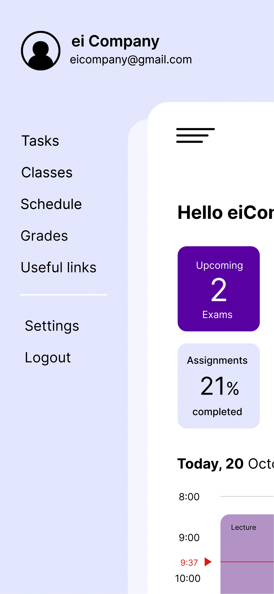
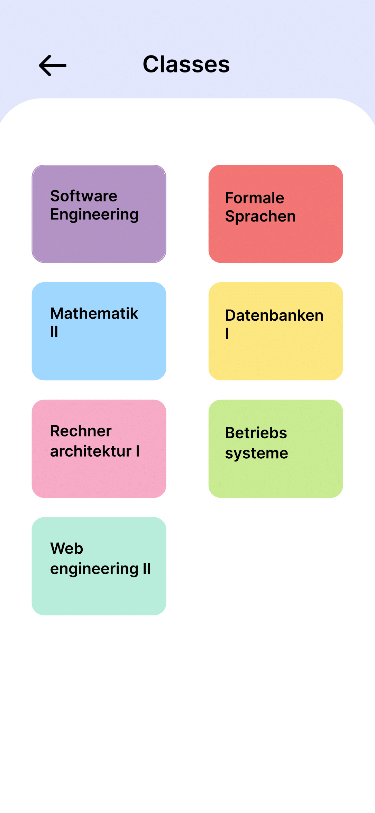
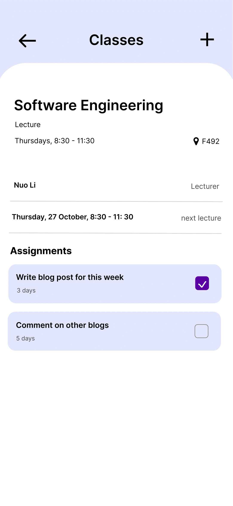

# Use-Case Specification: Seeing classes

# 1. Creating Events

## 1.1 Brief Description
This use case allows users to see the classes from their schedule.

## 1.2 Mockup
 &nbsp;  &nbsp; 

# 2. Flow of Events

## 2.1 Basic Flow
- user clicks on Menu - Classes
- data will be sent from database
- Classes page opens
- if user linked a Rapla URL, classes will be displayed
- for more details users can click on a class

# 3. Special Requirements

# 4. Preconditions
The Preconditions for this use case are:
1. The user has the app installed
2. User needs an account to create events
3. User has Rapla linked

# 5. Postconditions
Class is displayed

# 6. Function Points
Total number of story points: 8
