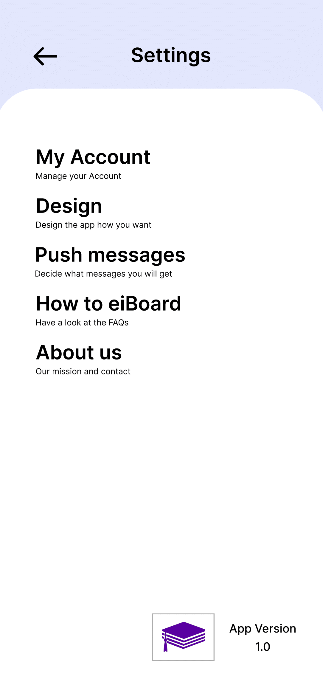
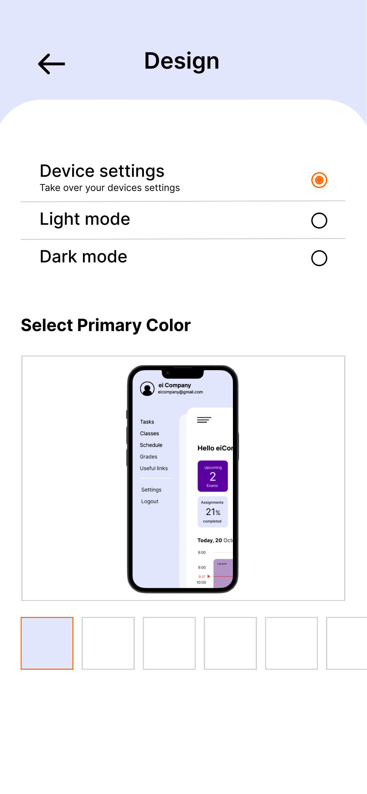
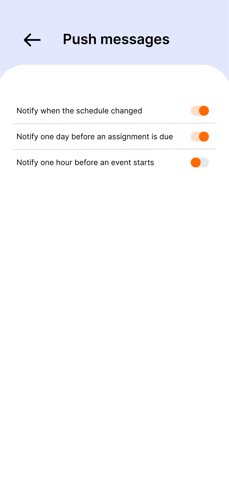

# Use-Case Specification: Settings

# 1. Settings

## 1.1 Brief Description
This use case allows a user to have more control over the app. In the settings the user can navigate to: Profile, Design, Push messages, FAQ and About Us.
Profile page - users can change their profile picture, name, E-Mail, password and the Rapla link from where their schedule will be imported
Design page - users can choose whether they want the app design to be in light or dark mode and choose the primary color for a tailored user experience
Push messages page - users can choose whether they want to receive push messages from eiBoard and if so what kind of messages
FAQ and About Us page - users can come here for help and to find out more about eiBoard

## 1.2 Mockup
 &nbsp;  &nbsp;  &nbsp;   &nbsp; 

# 2. Flow of Events

## 2.1 Basic Flow
- user clicks on Menu - Settings and chooses from there
- see in 1.1 what user can change

# 3. Special Requirements

# 4. Preconditions
The Preconditions for this use case are:
1. The user has the app installed
2. User needs an account

# 5. Postconditions
- App Design will have changed if user changed design
- User data will have changed if user changed data in his profile
- User will receive push messages or not

# 6. Function Points
Total number of story points: 13
